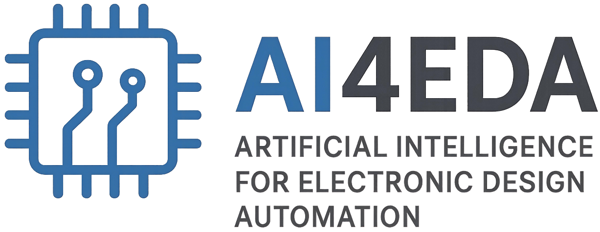

<div align="center">


<h3> AI4EDA: AI Works for Electronic Design Automation </h3>

<p align="center">
    <a title="GitHub Watchers" target="_blank" href="https://github.com/OSCC-Project/awesome-AIEDA-works/watchers">
        
    </a>
    <a title="GitHub Stars" target="_blank" href="hhttps://github.com/OSCC-Project/awesome-AIEDA-works/stargazers">
        
    </a>
    <a title="GitHub Forks" target="_blank" href="https://github.com/OSCC-Project/awesome-AIEDA-works/network/members">
        
    </a>
</p>
</div>


🚀 A curated and structured collection of **AI-driven research, tools, datasets, and frameworks** for **Electronic Design Automation (EDA)** and **chip design automation**.

This repository focuses on the intersection of:

- ✅ Artificial Intelligence (AI)
- ✅ Chip / IC Design
- ✅ EDA Infrastructure
- ✅ Physical Design & Logic Synthesis
- ✅ AI Foundation Models for EDA
- ✅ AI for Chip Design Automation

> 📌 **This is an open-source, community-maintained list. Contributions are welcome.**

---
## 📚 Table of Contents

- [1. AI for EDA Infrastructure](#1-ai-for-eda-infrastructure)
  - [1.1 Chip Data](#11-chip-data)
  - [1.2 AI for EDA Libraries & Tools](#12-ai-for-eda-libraries--tools)
  - [1.3 AI for EDA Datasets](#13-ai-for-eda-datasets)
- [2. AI for Logic Synthesis](#2-ai-for-logic-synthesis)
  - [2.1 Circuit Representation & Analysis](#21-circuit-representation--analysis)
  - [2.2 Logic Optimization](#22-logic-optimization)
  - [2.3 Technology Mapping](#23-technology-mapping)
  - [2.4 Exact Synthesis & Generative Models](#24-exact-synthesis--generative-models)
- [3. AI for Physical Design](#3-ai-for-physical-design)
  - [3.1 Placement](#32-placement)
  - [3.2 Routing](#33-routing)
  - [3.3 Timing & Power](#34-timing--power)
  - [3.4 Routability & DRC](#35-routability--drc)
- [4. AI for Verification](#4-ai-for-verification)
- [5. AI for Test Synthesis](#5-ai-for-test-synthesis)
- [6. AI for Hardware Security](#6-ai-for-hardware-security)
- [7. AI for Physical-Level Simulation](#7-ai-for-physical-level-simulation)
- [Contributing](#contributing)
- [License](#license)
---


## **1. AI for EDA Infrastructure**

###  **1.1 Chip Data**
- CHIPS Alliance
- ispras/hdl-benchmarks: Collection of Digital Hardware Modules & Projects Benchmarks
- Unveiling the ISCAS-85 benchmarks: A case study in reverse engineering  
- The epfl combinational benchmark suite  
- Exact benchmark circuits for logic synthesis  
- Opencores  
- Rt-level itc’99 benchmarks and first atpg results
- OSCC IP Project
- efabless/openlane2-ci-designs: Continuous Integration Designs for OpenLane 2.0.0 or higher
- Open Source Chip Project by University (OSCPU)

### **1.2 AI for EDA Library**
- AiEDA: AiEDA: An Open-Source AI-Aided Design Library for Design-to-Vector
- iEDA: An Open-source Infrastructure of EDA
- iPD: An Open-source intelligent Physical Design Toolchain
- OpenLS-DGF: An adaptive open-source dataset generation framework for machine learning tasks in logic synthesis  
- Building openlane: a 130nm openroad-based tapeout-proven flow
- Toward an Open-Source Digital Flow: First Learnings from the OpenROAD Project
- Benchmarking End-To-End Performance of AI-Based Chip Placement Algorithms
- SiliconCompiler: A distributed approach to silicon compilation
- METRICS2.1 and Flow Tuning in the IEEE CEDA Robust Design Flow and OpenROAD ICCAD Special Session Pape
- CircuitOps: An ML Infrastructure Enabling Generative AI for VLSI Circuit Optimization

### **1.3 AI for EDA Dataset**
- Circuitnet: An open-source dataset for machine learning in vlsi cad applications with improved domain-specific evaluation metric and learning strategies  
- Circuitnet 2.0: An advanced dataset for promoting machine learning innovations in realistic chip design environment  
- ForgeEDA: A Comprehensive Multimodal Dataset for Advancing EDA
- EDA-schema: A Graph Datamodel Schema and Open Dataset for Digital Design Automation
- iDATA: Bridging AI and EDA with an Open-Source Multi-Modal Vector Dataset for Physical Design


## **2. AI for Logic Synthesis**
A Survey of Machine Learning Approaches in Logic Synthesis

### **2.1 AI for Circuit Analysis**

- Graph representation learning: a survey  
- Drills: Deep reinforcement learning for logic synthesis  
- Openabc-d: A large-scale dataset for machine learning guided integrated circuit synthesis  
- Area-driven fpga logic synthesis using reinforcement learning  
- Semi-supervised classification with graph convolutional networks  
- Inductive representation learning on large graphs  
- Neural message passing for quantum chemistry  
- Deepgate2: Functionality-aware circuit representation learning  
- Gamora: Graph learning based symbolic reasoning for large-scale boolean networks  
- Directed acyclic graph neural networks  
- Graph attention networks  
- D-vae: A variational autoencoder for directed acyclic graphs  
- Functionality matters in netlist representation learning  
- Deepgate: learning neural representations of logic gates  
- Deepseq: Deep sequential circuit learning  
- Deepseq2: Enhanced sequential circuit learning with disentangled representations  
- Deepgate3: Towards scalable circuit representation learning  
- Converts: Contrastively learning structurally invariant netlist representations  
- Deep learning-based circuit recognition using sparse mapping and level-dependent decaying sum circuit representations  
- Circuit representation learning with masked gate modeling and verilog-AIG alignment  
- High-speed adder design space exploration via graph neural processes  
- Deepcell: Multiview representation learning for post-mapping netlists  
- Fgnn2: A powerful pretraining framework for learning the logic functionality of circuits  
- Deepsat: An eda-driven learning framework for sat  
- Versatile multi-stage graph neural network for circuit representation  
- Calculating signal controllability using neural networks: Improvements to testability analysis and test point insertion  
- Test point insertion with deep reinforcement learning  
- Graph learning-based arithmetic block identification  
- Graph neural network based netlist operator detection under circuit rewriting  
- Invited paper: Verilog-to-pyg - a framework for graph learning and augmentation on rtl designs  
- The vtr project: architecture and cad for fpgas from verilog to routing  
- Deepgate4: Efficient and effective representation learning for circuit design at scale  
- Less is more: Hop-wise graph attention for scalable and generalizable learning on circuits  
- Polargate: Breaking the functionality representation bottleneck of and-inverter graph neural network


### **2.2 AI for Logic Optimization**

- FRAIGs: A unifying representation for logic synthesis and verification  
- Delay optimization using SOP balancing  
- Scalable logic synthesis using a simple circuit structure  
- Deep learning for logic optimization algorithms  
- How powerful are graph neural networks?  
- Lostin: Logic optimization via spatio-temporal information with hybrid graph models  
- The prediction of the quality of results in logic synthesis using transformer and graph neural networks  
- Multimodal deep learning for biomedical data fusion: a review  
- Mtlso: A multi-task learning approach for logic synthesis optimization  
- Logic synthesis optimization with predictive self-supervision via causal transformers  
- Developing synthesis flows without human knowledge  
- Decision making in synthesis cross technologies using lstms and transfer learning  
- GRANNITE: Graph neural network inference for transferable power estimation  
- Bulls-eye: Active few-shot learning guided logic synthesis  
- Lstp: A logic synthesis timing predictor  
- Congestionnet: Routing congestion prediction using deep graph neural networks  
- Ceconp: Exploring node centrality for early routing congestion prediction  
- Lsoracle: a logic synthesis framework driven by artificial intelligence: Invited paper  
- The map method for synthesis of combinational logic circuits  
- HeLO: A heterogeneous logic optimization framework by hierarchical clustering and graph learning  
- Boils: Bayesian optimisation for logic synthesis  
- Batch sequential black-box optimization with embedding alignment cells for logic synthesis  
- Alphasyn: Logic synthesis optimization with efficient monte carlo tree search  
- Retrieval-guided reinforcement learning for boolean circuit minimization  
- Automatic multi-parameter tuning for logic synthesis with reinforcement learning  
- Exploring logic optimizations with reinforcement learning and graph convolutional network  
- Logic synthesis optimization sequence tuning using rl-based lstm and graph isomorphism network  
- Easyso: Exploration-enhanced reinforcement learning for logic synthesis sequence optimization and a comprehensive rl environment  
- Flowtune: End-to-end automatic logic optimization exploration via domain-specific multiarmed bandit  
- An efficient reinforcement learning based framework for exploring logic synthesis  
- AISyn: AI-driven reinforcement learning-based logic synthesis framework  
- Adaptive reconvergence-driven aig rewriting via strategy learning  
- A circuit domain generalization framework for efficient logic synthesis in chip design  
- Slap: A supervised learning approach for priority cuts technology mapping  
- Rl-mul: Multiplier design optimization with deep reinforcement learning  
- Prefixrl: Optimization of parallel prefix circuits using deep reinforcement learning  
- Circuitvae: Efficient and scalable latent circuit optimization
- AiLO: A Predictive Framework for Logic Optimization Using Multi-Scale Cross-Attention Transformer

### **2.3 AI for Technology Mapping**

- A new retiming-based technology mapping algorithm for LUT-based FPGAs  
- A survey of boolean matching techniques for library binding  
- Flowmap: an optimal technology mapping algorithm for delay optimization in lookup-table based fpga designs  
- Simultaneous depth and area minimization in lut-based fpga mapping  
- Combinational and sequential mapping with priority cuts  
- Slap: A supervised learning approach for priority cuts technology mapping  
- Attention-based mechanism for technology mapping optimization  
- Machine-learning based delay prediction for fpga technology mapping  
- Lightgbm: A highly efficient gradient boosting decision tree  
- Aimap: Learning to improve technology mapping for asics via delay prediction


### **2.4 AI for Exact Synthesis**

- Multiple-valued minimization for PLA optimization  
- Practical sat-a tutorial on applied satisfiability solving  
- Logic synthesis meets machine learning: Trading exactness for generalization  
- International workshop on logic and synthesis contest  
- A review of machine learning in logic synthesis  
- On PAC learning algorithms for rich boolean function classes  
- Statistical queries and statistical algorithms: Foundations and applications  
- Towards next-generation logic synthesis: A scalable neural circuit generation framework  
- DARTS: Differentiable architecture search  
- Deep differentiable logic gate networks  
- Categorical reparameterization with gumbel-softmax  
- Seadag: Semi-autoregressive diffusion for conditional directed acyclic graph generation  
- Neural combinatorial logic circuit synthesis from input-output examples  
- Optimizing computer systems with more generalized ai tools  
- Architect of the bits world: Masked autoregressive modeling for circuit generation guided by truth table  
- Shortcircuit: Alphazero-driven generative circuit design  
- Circuit transformer: A transformer that preserves logical equivalence  
- Logic synthesis with generative deep neural networks  
- Boolformer: Symbolic regression of logic functions with transformers  
- Can symbolic regression of boolean functions boost logic synthesis?  
- Sampling-based approximate logic synthesis: An explainable machine learning approach  
- LayerDAG: A layerwise autoregressive diffusion model for directed acyclic graph generation  
- Beswac: Boosting exact synthesis via wiser sat solver call


## **3. AI for Physical Implementation**

🚧 Under active expansion

### **3.1 AI for Placement**

### **3.2 AI for Routing**

### **3.3 AI for Timing and Power**

### **3.4 AI for Routability and DRC**


## **4. I for Verification**
- Machine learning methods in solving the boolean satisfiability problem  
- Machine learning for automated theorem proving: Learning to solve sat and qsat  
- Learning a sat solver from single-bit supervision  
- Predicting propositional satisfiability via end-to-end learning  
- Predicting propositional satisfiability based on graph attention networks  
- Satformer: Transformer-based unsat core learning  
- Learning to solve circuit-sat: An unsupervised differentiable approach  
- Sat-gatv2: A dynamic attention-based graph neural network for solving boolean satisfiability problem  
- Goal-aware neural sat solver  
- Guiding high-performance sat solvers with unsat-core predictions  
- Can q-learning with graph networks learn a generalizable branching heuristic for a sat solver?  
- Learning local search heuristics for boolean satisfiability  
- Neuroback: Improving cdcl sat solving using graph neural networks  
- Learning cubing heuristics for sat from drat proofs  
- Graph neural reasoning may fail in certifying boolean unsatisfiability  
- Nlocalsat: Boosting local search with solution prediction


## **5. AI for Test Synthesis**
- On using machine learning for logic bist  
- A survey and recent advances: Machine intelligence in electronic testing  
- Test point insertion using artificial neural networks  
- Applying neural networks to delay fault testing: Test point insertion and random circuit training  
- High performance graph convolutional networks with applications in testability analysis  
- Applying artificial neural networks to logic built-in self-test: Improving test point insertion  
- Test point selection using deep graph convolutional networks and advantage actor critic (a2c) reinforcement learning  
- Toward zero backtracks in test pattern search algorithms with machine learning  
- Machine intelligence for efficient test pattern generation  
- Training neural network for machine intelligence in automatic test pattern generator  
- A graph autoencoder approach for fault prediction in test pattern generation  


## **6. AI for Hardware Security**
- Sail: Machine learning guided structural analysis attack on hardware obfuscation  
- An oracle-less machine-learning attack against lookup-table-based logic locking  
- Untangle: Unlocking routing and logic obfuscation using graph neural networks-based link prediction  
- Galu: A genetic algorithm framework for logic unlocking  
- Omla: An oracle-less machine learning-based attack on logic locking  
- Muxlink: Circumventing learning-resilient mux-locking using graph neural network-based link prediction  
- INSIGHT: Attacking Industry-Adopted learning resilient logic locking techniques using explainable graph neural network  
- Gnnreveal: A novel graph neural network-based attack method for ic logic gate de-camouflaging  
- Gnn-re: Graph neural networks for reverse engineering of gate-level netlists  
- Flip-lock: A flip-flop-based logic locking technique for thwarting ml-based and algorithmic structural attacks  
- Gnn4ip: Graph neural network for hardware intellectual property piracy detection


## **7. AI for Physical Simulation**

## **8. AI for TCAD Simulation**

## **9. AI for Thermal Analysis**

## **10. AI for Mechanical Stress**

## **11. AI for EM / IR Drop Estimation**

## 🤝 Contributing

We welcome contributions from the community! You can contribute by:

- Adding new papers, tools, datasets, or projects
- Fixing links and formatting
- Adding missing categories
- Improving descriptions

### How to contribute

```
Fork this repo → Create a new branch → Make changes → Submit a PR
```


## 📄 License

This list is released under the MIT License.


### **⭐ If you find this useful, please consider starring the repo and contributing!**